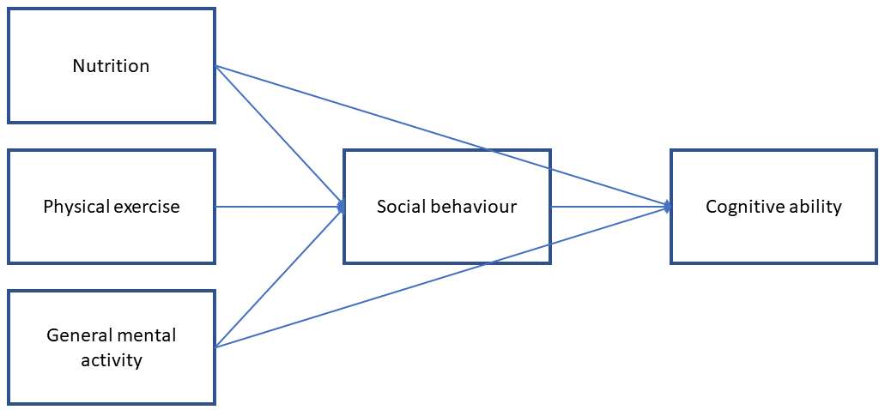
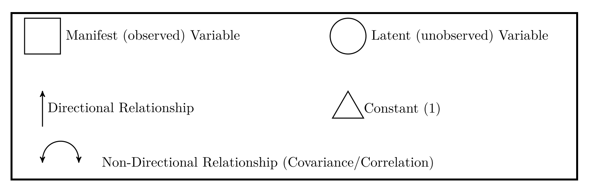
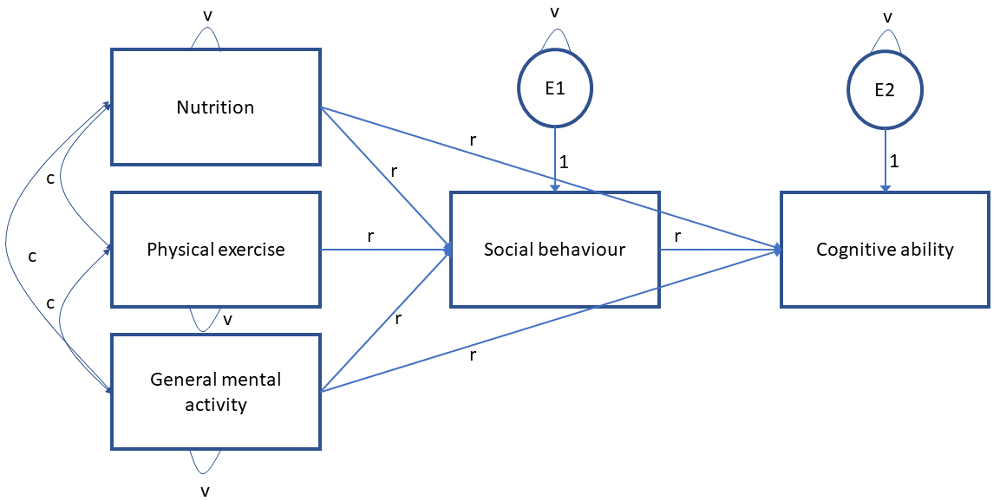
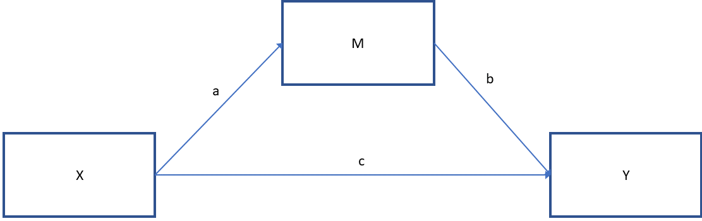
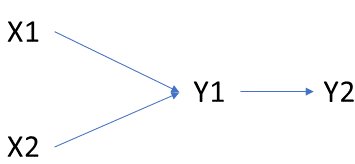

```{r setup, include=FALSE}
options(htmltools.dir.version = FALSE)
knitr::opts_chunk$set(
  fig.width=9, fig.height=3.5, fig.retina=3,
  out.width = "100%",
  cache = FALSE,
  echo = TRUE,
  message = FALSE, 
  warning = FALSE,
  hiline = TRUE
)
```

```{r xaringan-themer, include=FALSE, warning=FALSE}
library(xaringanthemer)
style_mono_accent(
  base_color = "#440099",
  header_font_google = google_font("Helvetica"),
  text_font_google   = google_font("Helvetica", "300", "300i"),
  code_font_google   = google_font("Fira Code"),
  code_font_size = '1.1rem',
  text_color = 'black',
  text_font_size = '24px',
  colors = c(red = "#f34213",
             green = "#136f63")
)
```

## Press record

---

## Intended learning outcomes

Motivate utilisation of path and CFA models; Argue how they connect to other models that we covered at the course. <br/><br/>

Calculate number of free parameters and degrees of freedom of the proposed model. <br/><br/>

Build a model in R statistical environment, estimate, and interpret the coefficients. <br/><br/>

Criticise, modify, compare, and evaluate the fit of the proposed models. 


---
## Structural equation modelling (SEM)

General framework that uses various models to test relationships among variables <br/>

Other terms: covariance structure analysis, covariance structure modelling, __causal modelling__<br/>

Sewell Wright - "mathematical tool for drawing __causal__ conclusions from a combination of of observational data and __theoretical assumptions__" 

Waves:
  1. Causal modelling through path models <br/>
  2. Latent structures - factor analysis <br/>
  3. Structural causal models <br/> <br/><br/>
  
SEM is a general modelling framework that is composed of measurement model and the structural model. 

???
Judea Pearl - [The Causal Foundations of Structural Equation Modeling](https://ftp.cs.ucla.edu/pub/stat_ser/r370.pdf)

Measurement model focuses on the estimation of latent or composite variables <br/>
Structural model focuses on the estimation of relations between manifest  and/or latent variables in the model (path model) <br/>

Terminology:  <br/>

Manifest variables: observed/collected variables <br/> <br/> 
Latent variables: infered measures - hypothetical constructs  <br/>
 - Indicator variables: measures used to infer the latent concepts
<br/>
<br/> 

Endogenous variables: dependent outcomes <br/> <br/> 
Exogenous variables: predictors <br/> <br/> <br/> 

Focus on covariance structure instead of mean <br/> <br/> 
---
## Structural part of the model (path analysis)

Model that test relationship between set of variables, often arranged in some sort of structural form.
<br/>

A common focus of the path model is the estimation of mediation between X and Y.

.center[
 <br/>
]

???
.center[
 <br/>
]
---

## First step: Specification of the model

Previous findings show that development of cognitive abilities in people depends on a range of factors in infancy and early childhood. General mental/cognitive abilities (e.g. reading or drawing), varied nutrition, physical exercises, and social engagement have shown to influence the level of cognitive abilities. Based on some of these studies, researchers postulate that social engagement is mediating factor between the behavioural factors and development of cognitive abilities. <br/> <br/>

.center[
 <br/>
]
???
Representation of our hypothetical assumptions in the form of the structural equation model
---

## Can model be estimated? 

Total Number of the parameters that we can estimate: $\frac{variables*(variables+1)}{2}$ <br/> <br/> <br/>


.center[
 <br/>
]

---
## Number of observations

```{r,echo=F, warning=FALSE, message=FALSE}
library(truncnorm)
require(lavaan)
set.seed(456)
Babies=data.frame(Age=round(runif(100,1,30)), Weight=rnorm(100,4000,500))
Babies$Height=rnorm(100,40+0.2*Babies$Age+0.004*Babies$Weight, 5)
Babies$Sex=rbinom(100,1,0.5)
Babies$Nutrition=rtruncnorm(n=100, a=0, b=30, mean=5, sd=10)
Babies$PhyExer=rnorm(100, 180,50)
Babies$GMA=rnorm(100, 180,50)
Babies$SocialBeh=rnorm(100, 180+Babies$PhyExer,80)
Babies$TummySleep=rbinom(100,1,0.5)
Babies$CognitiveAb=rnorm(100,10+7*Babies$Nutrition+0.1*Babies$PhyExer+3*Babies$GMA+0.03*Babies$PhyExer*Babies$SocialBeh,5)
Babies$Sex=as.factor(Babies$Sex)
levels(Babies$Sex)=c('Girls','Boys')
```

```{r}
Matrix<-cov(Babies[,c('Nutrition','PhyExer','GMA','SocialBeh','CognitiveAb')])
Matrix[upper.tri(Matrix)]<-NA
knitr::kable(Matrix, format = 'html')
```

---
## How many parameters are we estimating (path model)?

How many degrees of freedom do we have without the model? 

--
.center[
 <br/>
]

Number of observations (total number of parameters) = 15<br/>
Empty model = variances and covariances <br/>
Degrees of freedom (df) __= 15 - 8 = 7__ <br/>

???
Most of the time (CFA model or other software):
Degree of freedom for null model = $(\frac{variables*(variables+1)}{2}) - variables$

```{r}
Matrix<-cov(Babies[,c('Nutrition','PhyExer','GMA','SocialBeh','CognitiveAb')])
Matrix[upper.tri(Matrix)]<-NA
Matrix[lower.tri(Matrix)]<-NA
knitr::kable(Matrix, format = 'html')
```
---
## How many parameters (our model)?

.center[
 <br/>
]

Free parameters = variances + covariances + regression pathways = 14
---

## Second step: model identification

1. Under-indentified: more free parameters than total possible parameters  <br/> <br/>
2. Just-identified: equal number of free parameters and total possible parameters  <br/><br/>
3. Over-identified: fewer free parameters than total possible parameters  <br/> <br/>
<br/>
Parameters can either be: free, fixed or constrained  <br/>

---

## Third step: estimation of the model

```{css, echo=FALSE}
pre {
  max-height: 260px;
  overflow-y: auto;
}

pre[class] {
  max-height: 80px;
}
```

```{css, echo=FALSE}
.scroll-100 {
  max-height: 80px;
  overflow-y: auto;
  background-color: inherit;
}
```

```{r , warning=FALSE, message=FALSE}
modelAbility<-'
SocialBeh~Nutrition+PhyExer+GMA
CognitiveAb~SocialBeh+Nutrition+GMA
'
```
--
```{r, warning=FALSE, message=FALSE}
fit1<-sem(modelAbility, data=Babies)
summary(fit1)
```

---

## Step four: model evaluation

Chi-square test: measure of how well model-implied covariance matrix fits data covariance <br/> <br/>

We would prefer not to reject the null hypothesis in this case <br/>

Assumptions: <br/>
Multivariate normality <br/>
N is sufficiently large (150+)<br/>
Parameters are not at boundary or invalid (e.g. variance of zero)<br/><br/><br/>

With the large samples it is sensitive to small misfits <br/>
Nonormality induces bias <br/> 
---

## Other fit indices
```{r}
summary(fit1, fit.measures=TRUE)

```

---

## Other fit indices
.center[

]

???
TLI: fit of .95 indicates that the fitted model improves the fit by 95% relative to the null mode, works OK with smaller sample sizes <br/> <br/>
CFI: Same as TLI, but not very sensitive to sample size <br/> <br/>
RMSEA: difference between the residuals of the sample covariance matrix and hypothesized model. If we have different scales it is hard to interpret, then we can check standardised root mean square residual (SRMR)<br/><br/>
---

## Model modification

Add/take out theoretical pathways:

```{r , warning=FALSE, message=FALSE}
modelAbility2<-'
SocialBeh~Nutrition+PhyExer+GMA
CognitiveAb~SocialBeh+Nutrition+GMA+PhyExer
'
fit2<-sem(modelAbility2, data=Babies)
summary(fit2, fit.measures=TRUE)
```

---

## We can compare the models

```{r}
lavTestLRT(fit1,fit2)
```


---

## Or check modification indices

```{r}
modindices(fit1, sort=TRUE)
```

---

## Direct and indirect

.center[
 
]

Direct effect (c): subgroups/cases that differ by one unit on X, but are equal on M are estimated to differ by __c__ units on Y. <br/>

Indirect effect: <br/>
  a) X -> M: cases that differ by one unit in X are estimated to differ by __a__ units on M <br/>
  b) M -> Y: cases that differ by one unit in M, but are equal on X, are estimated to differ by __b__ units on Y <br/><br/>
The indirect effect of X on Y through M is a product of __a__ and __b__. The two cases that differ by one unit on X are estimated to differ by __ab__ units on Y as a result of the effect of X on M which affects Y. 

---
## Direct and indirect

```{r, warning=FALSE, message=FALSE}
modelAbilityPath<-'
SocialBeh~Nutrition+a*PhyExer+GMA
CognitiveAb~b*SocialBeh+c*PhyExer+GMA

indirect := a*b
direct := c
total := indirect + direct
'
fitPath<-sem(modelAbilityPath, data=Babies)
summary(fitPath)
```
???
Interaction between the predictors can be included similar to the linear regression model by using (:) sign.<br/> <br/>

modelAbilityInteraction<-<br/>
SocialBeh~Nutrition+PhyExer+GMA+__PhyExer:GMA__<br/>
CognitiveAb~SocialBeh+Nutrition+GMA<br/>

---
## Prerequisites

Theory: Strong theoretical assumptions that could be used to draw causal assumptions that could be tested using the data and specification of the model <br/><br/>

Data: large samples, N:p rule - 20:1, more data usually better estimates. <br/>
 - We are not that interested in significance: <br/><br/>
  a) Overall behaviour of the model more interesting<br/><br/>
  b) More data higher probability of significant results (weak effects)<br/><br/>
  c) Latent models are estimated by anchoring on indicator variables, different estimation can result in different patterns<br/><br/>

---
## Problems with SEM and alternatives

1. Variables derived from the normal distribution <br/>
2. Observations independent <br/>
3. Large sample size <br/>

---
## PiecewiseSEM
.center[
 
]

Variables are causally dependent if there is an arrow between them <br/>
They are causally independent if there are no arrows between them <br/>
<br/>
X1 is causally independent from Y2 _conditional_ on Y1

PiecewiseSEM performs a test of directional separation (d-sep) and asks whether causally independent paths are significant when controlling for variables on which causal process is conditional.

???
https://jonlefcheck.net/2014/07/06/piecewise-structural-equation-modeling-in-ecological-research/

---

## PiecewiseSEM 

```{r, warning=FALSE, message=FALSE}
#install.packages('piecewiseSEM)
require(piecewiseSEM)
model1<-psem(lm(SocialBeh~Nutrition+PhyExer+GMA, data=Babies),
             lm(CognitiveAb~SocialBeh+Nutrition+GMA, data=Babies))
summary(model1, .progressBar=FALSE)
```

---

## Important aspects: theory

- Difference between moderation and mediation <br/>
- Interpretation of the predictors <br/>
- Calculation of free parameters and total parameters <br/>
- Model identification: three-types of identifications <br/>
- Overall fit of the model 

---

## Important aspects: practice

- Building path model: both continous and categorical exogenous variables <br/>
- Calculation of the direct and indirect pathways for predictors of interest <br/>
- Adding an interaction to path model <br/>
- Interpretation of the coefficients <br/>
- Getting fit indices of the model <br/>

---
## Literature

Chapters 1 to 5 of Principles and Practice of Structural Equation Modeling by Rex B. Kline <br/><br/> 

Introduction to Mediation, Moderation, and Conditional Process Analysis: A Regression-Based Approach by Andrew F. Hayes <br/><br/> 

Latent Variable Modeling Using R: A Step-by-Step Guide by A. Alexander Beaujean <br/><br/>

---

# Thank you for your attention
